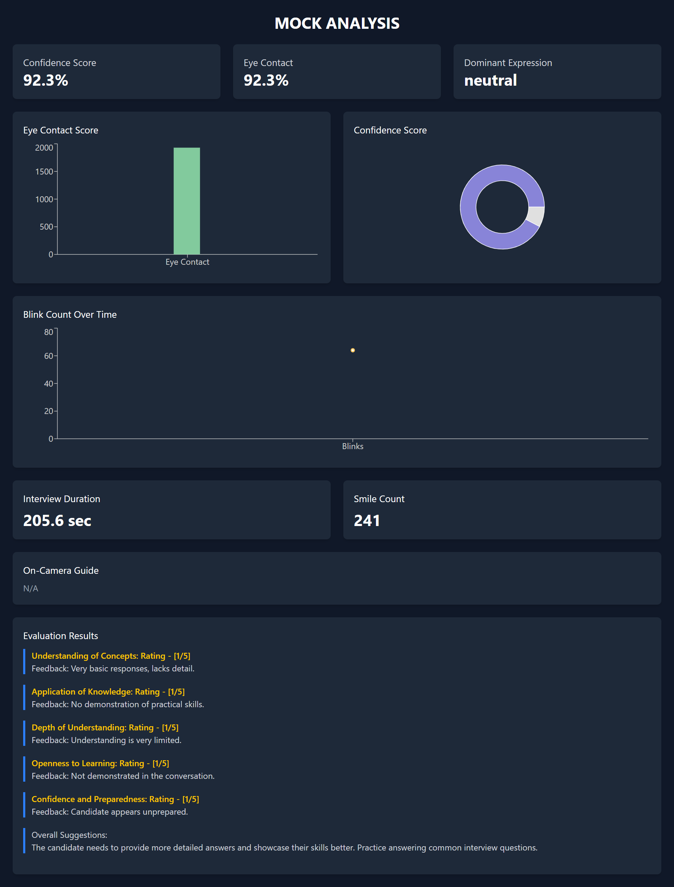

# 🤖 Mock AI Interview

A smart, interactive platform for conducting mock interviews using AI - built to help job seekers prepare for real technical interviews confidently and efficiently.

---

## 🚀 Features

- 🧠 **AI-Powered Interviewer**: Simulates HR, behavioral, and technical interviews using OpenAI GPT models.
- 📝 **Dynamic Question Generation**: Questions tailored to roles like Frontend Developer, Backend Developer, Data Scientist, and more.
- 📊 **Feedback & Scoring**: Real-time feedback on responses with scoring on communication, problem-solving, and technical accuracy.
- 📄 **Transcript & Analytics**: Interview summary with performance breakdown.
- 🎤 **Voice Support** : Respond using microphone and receive audio feedback.

---

## 🛠️ Tech Stack

- **Frontend**: React.js, Tailwind CSS
- **Backend**: Node.js
- **AI Integration**: Google Gemini API
- **Deployment**: Vercel

---

## 📸 Screenshots

#### Mock Interview in Progress


#### Feedback & Analysis


---

## 📦 Installation

```bash
# Clone the repository
git clone https://github.com/httpsvarad/PrepIQ-AI.git

# Install dependencies
npm install

# Set up environment variables
cp .env.example .env
# Add your Gemini key, DB URI, etc.

# Start the development server
npm run dev

---

## Author

Made with ❤️ by Varad Manegopale
